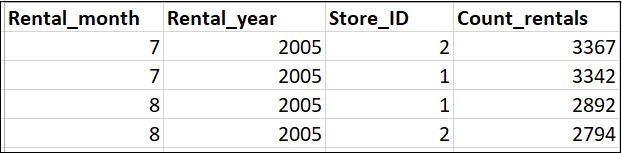
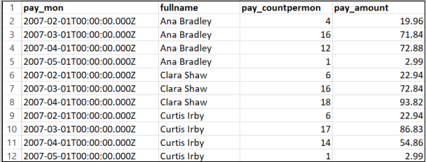

## Workspace

We have provided the Workspace at the end of the page for you to run your queries. Please feel free to use it to write your queries, run them, and export the data to a .csv file.

## Question Set 2

The questions in this question set use the more advanced techniques of the course. These are meant to help you practice some of these more advanced techniques. Again, you have the choice to use any of these questions or use your own. Remember, you need only to submit queries that meet the criteria as specified in the <a href="https://review.udacity.com/#!/rubrics/2095/view">Rubric</a>.

## Question 1:

We want to find out how the two stores compare in their count of rental orders during every month for all the years we have data for.  <b>Write a query that returns the store ID for the store, the year and month and the number of rental orders each store has fulfilled for that month. Your table should include a column for each of the following: year, month, store ID and count of rental orders fulfilled during that month.</b>

## Check Your Solution

The following table header provides a preview of what your table should look like. The count of rental orders is sorted in descending order.

HINT: One way to solve this query is the use of aggregations.

## Question 2

We would like to know who were our top 10 paying customers, how many payments they made on a monthly basis during 2007, and what was the amount of the monthly payments. <b>Can you write a query to capture the customer name, month and year of payment, and total payment amount for each month by these top 10 paying customers?</b>

## Check your Solution:

The following table header provides a preview of what your table should look like. The results are sorted first by customer name and then for each month. As you can see, total amounts per month are listed for each customer.

HINT: One way to solve is to use a subquery, limit within the subquery, and use concatenation to generate the customer name.

## Question 3

Finally, for each of these top 10 paying customers, I would like to find out the difference across their monthly payments during 2007. Please go ahead and <b>write a query to compare the payment amounts in each successive month.</b> Repeat this for each of these 10 paying customers. Also, it will be tremendously helpful if you can identify the customer name who paid the most difference in terms of payments.

## Check your solution:

The customer Eleanor Hunt paid the maximum difference of $64.87 during March 2007 from $22.95 in February of 2007.

HINT: You can build on the previous questions query to add Window functions and aggregations to get the solution.
